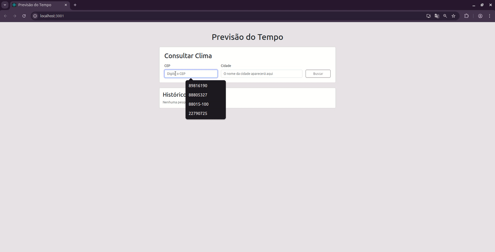

# Current Weather

Este é um projeto construído com React no front-end e Laravel no back-end. 
O objetivo da aplicação é consultar a previsão do tempo, salvar um histórico de pesquisas 
e permitir a comparação entre localidades.

## Stack de Tecnologias

*   **Front-end:**
    *   **React:** Para a construção da interface de usuário.
    *   **Bootstrap:** Para a estilização da interface.
    *   **Axios:** Para a comunicação HTTP com as APIs.
*   **Back-end:**
    *   **PHP / Laravel:** Para a construção de uma API RESTful.
    *   **SQLite:** Banco de dados.
*   **APIs Externas:**
    *   [ViaCEP](https://viacep.com.br/ ): Para obter o nome da cidade a partir de um CEP.
    *   [Weatherstack](https://weatherstack.com/ ): Para obter os dados da previsão do tempo.

---

## Arquitetura e Padrões de Código

Para garantir um projeto escalável e de fácil manutenção, foi aplicado os seguintes padrões e estruturas:

### Organização de Arquivos

1.  **Estrutura Monorepo (`/frontend` e `/backend`):** Escolhi manter o front-end e o back-end no mesmo repositório, mas em pastas separadas. Esta abordagem, conhecida como monorepo, facilita o gerenciamento do projeto como um só, ao mesmo tempo que mantém uma separação de responsabilidades entre back e front.

2.  **Back-end (Laravel - Padrão MVC):**
    *   **Controllers:** A lógica de recebimento de requisições e envio de respostas está nos Controllers (`WeatherHistoryController`). As responsabilidades são bem definidas: `fetch` para buscar, `store` para salvar, `index` para listar, etc.
    *   **Models:** A interação com o banco de dados é abstraída pelo Model Eloquent (`WeatherHistory`), que representa a tabela do histórico.
    *   **Routes:** As rotas da API (`routes/api.php`) são a porta de entrada da aplicação, direcionando cada endpoint para seu respectivo método no controller.
    *   **Configs:** Arquivos de configuração como `.env.example` e `composer.json`.
    
3.  **Front-end (React):**
    *   **Componentização:** A interface foi separada em componentes com responsabilidades únicas (Single Responsibility Principle), localizados na pasta `/src/components`. Por exemplo, `SearchForm` só cuida da busca, e a `WeatherDisplay` só exibe os dados.
    *   **Centralização de Chamadas de API:** A configuração do Axios foi centralizada em `/src/api/axiosConfig.js`. Para evitar a repetição da URL base da API.
    *   **Utilitários:** Funções puras e reutilizáveis, como a de tradução, foram isoladas em uma pasta `/src/utils`.

### Padrões de Código Aplicados

1.  **Levantamento de Estado (State Lifting):** O estado principal da aplicação (dados do clima, histórico, seleções) é gerenciado pelo componente pai (`App.js`) e distribuído para os componentes filhos via `props`. Isso cria um fluxo de dados unidirecional e previsível, facilitando a depuração e o raciocínio sobre o código.

2.  **Componentes Controlados:** Os inputs do formulário são "componentes controlados", onde o valor do input é diretamente ligado a uma variável de estado do React (`useState`). Isso dá ao React controle total sobre o formulário.

3.  **Hooks do React:**
    *   **`useState`:** Para gerenciar o estado local de cada componente (ex: o CEP digitado).
    *   **`useEffect`:** Para executar "efeitos colaterais", como buscar dados de uma API externa (`ViaCEP`) em resposta a uma mudança de estado.

4**Código Limpo e Legível:** Busquei usar nomes de variáveis e funções claros e descritivos, adicionei comentários em pontos-chave como nas rotas api.

---

## Como Executar o Projeto

### Pré-requisitos

*   PHP >= 8.2 (com a extensão `pdo_sqlite` habilitada)
*   Composer
*   Node.js e NPM

### 1. Configuração do Back-end

**Abra um terminal** e execute os seguintes comandos:

1.  **Navegue até a pasta do back-end:** `cd backend`
2.  **Instale as dependências:** `composer install`
3.  **Configure o ambiente:** `cp .env.example .env`
    *   *Abra o arquivo `.env` e adicione sua `WEATHERSTACK_ACCESS_KEY`.*
4.  **Gere a chave da aplicação:** `php artisan key:generate`
5.  **Prepare o banco de dados:** `touch database/database.sqlite && php artisan migrate`
6.  **Inicie o servidor da API:** `php artisan serve`
    *   *A API estará disponível em `http://127.0.0.1:8000`.*

---

### 2. Configuração do Front-end

**Abra um segundo terminal** (mantenha o servidor da API rodando).

1.  **Navegue até a pasta do front-end:** `cd frontend`
2.  **Instale as dependências:** `npm install`
3.  **Inicie o servidor de desenvolvimento:** `npm start`
    *   *A aplicação abrirá em `http://localhost:3000`.*

## Demonstração

